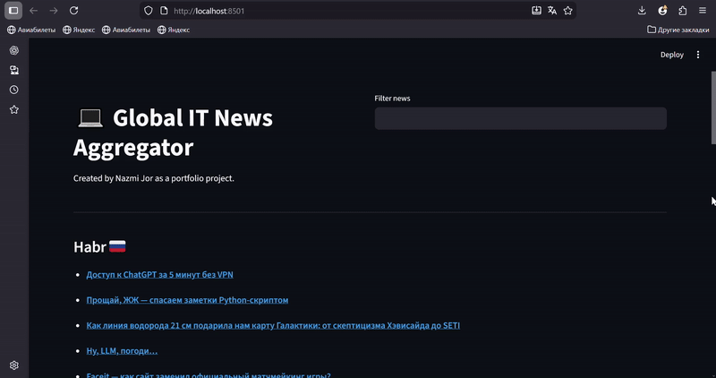

💻 Global IT News Aggregator

A portfolio project by Nazmi Jor.

 Overview

Global IT News Aggregator is a web application built with Streamlit that collects and displays the latest IT and technology news from multiple global sources.  
The app provides a clean interface, keyword-based filtering, and fast data loading using RSS feeds.

This project was created as a portfolio project to demonstrate practical Python skills, working with external data sources, and building interactive web applications.

Features

- Aggregates news using "RSS feeds" (stable, no JavaScript required):
  - Hacker News  
  - TechCrunch  
  - The Verge  
  - Habr
- Keyword-based news filtering
- Clean and intuitive Streamlit interface
- Cached data for faster load times
- "Refresh News" button to manually update the feed

 📷 Demo

 ⚙️ Technologies & Stack

1. Python 3.11+
2. Streamlit - web application framework
3. Pandas - data manipulation
4. Feedparser - RSS feed parsing

How to Run the Project Locally

1. Clone the repository
bash
git clone https://github.com/satosan8/global_it_news_aggregator.git
cd global_it_news_aggregator
